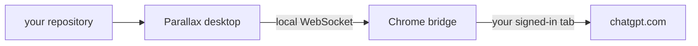

#  parallax

Parallax works through repositories from a native desktop workspace. Its Chrome
extension drives a separate ChatGPT task tab, returns the response to the correct
desktop thread, and requires no API key or second account.

<p>
  <a href="https://parallax.akshith.io">Download for macOS</a>
</p>

This is one pnpm monorepo with three packages:

| Package | Purpose |
| --- | --- |
| `app` | Electron and Next.js desktop application |
| `ext` | Chrome extension connecting ChatGPT task tabs to the desktop app |
| `web` | Download site deployed at [parallax.akshith.io](https://parallax.akshith.io) |

## How it works



1. A message starts in a Parallax project thread.
2. The Electron process sends it to the extension over a local WebSocket on port
   `8765`.
3. The extension creates or reuses a ChatGPT Project named `plx-{folder name}`,
   then creates or reuses that thread's inactive task tab inside it.
4. The extension submits the message and returns the streamed response to the
   matching desktop thread.
5. Parallax runs allowed workspace actions and continues the turn until ChatGPT
   produces a final response.

Repository access, desktop conversation state, and the bridge connection stay on
the Mac. ChatGPT traffic uses the signed-in browser session. Parallax stores no
model credentials and operates no developer data server.

## Features

- Project folders mirrored to ChatGPT Projects named `plx-{folder name}`
- Persistent, project-specific conversations
- Streaming responses and automatic workspace-action execution
- Read, list, search, run, and write actions with configurable permissions
- File attachments and drag-and-drop uploads
- Dynamic model and intelligence selection
- Built-in terminal and file side panel
- Conversation search, rename, archive, restore, and deletion
- Project opening in VS Code, Cursor, Zed, IntelliJ IDEA, or Finder
- Background application updates through GitHub Releases

## Requirements

- macOS
- Node.js 18 or later
- pnpm 10
- Google Chrome with the [Parallax extension](https://chromewebstore.google.com/detail/parallax/bfnlhalnojbjoipblfnhhljffajanaei?authuser=0&hl=en-GB) installed
- A signed-in ChatGPT tab in the same Chrome profile

## Development

Install all workspace dependencies from the repository root:

```bash
pnpm install
```

Start the desktop application:

```bash
pnpm dev
```

Start the website:

```bash
pnpm dev:website
```

Load the extension locally:

1. Open `chrome://extensions`.
2. Enable **Developer mode**.
3. Select **Load unpacked**.
4. Choose the repository's `ext` directory.
5. Open the extension popup and enable the local bridge.

Run every package's tests, type checks, browser workflows, and production build:

```bash
pnpm verify
```

Useful package-specific commands still run from the repository root:

```bash
pnpm --filter @parallax/app run test:component
pnpm --filter @parallax/app run test:integration
pnpm --filter @parallax/app run test:workflow
pnpm --filter @parallax/ext package
pnpm --filter @parallax/web run test:workflow
```

The desktop workflow tests use a deterministic local bridge. They do not require
Chrome, a ChatGPT account, or a live extension connection.

## Workspace protocol

The desktop app adds a compact workspace protocol to the first message in every
thread. ChatGPT can request actions such as:

```text
{plx:note}Inspecting the source{/plx:note}
{plx:run}rg -n "TODO|FIXME" src{/plx:run}
{plx:write path="src/example.ts"}entire file contents{/plx:write}
{plx:done}The requested change is complete.{/plx:done}
```

Permission checks are enforced before an action can change the selected project.
Tool results return through the same thread so the action loop remains ordered.

## Project structure

```text
.
├── app/
│   ├── components/          React interface
│   ├── hooks/               Conversation and workspace state
│   ├── lib/                 Protocol, execution, transport, and release logic
│   ├── pages/               Next.js pages
│   ├── test/                Unit, component, integration, and workflow tests
│   ├── main.js              Electron main process
│   └── preload.js           Renderer IPC bridge
├── ext/
│   ├── scripts/             Packaging, store publishing, and asset generation
│   ├── src/                 Extension runtime
│   ├── store/               Chrome Web Store copy and graphic assets
│   └── test/                Extension tests
├── web/
│   ├── api/                 Release-backed download endpoints
│   ├── public/              Static site and privacy policy
│   └── test/                Website tests
├── scripts/                 Monorepo-wide verification and icon generation
├── package.json             Root commands
└── pnpm-workspace.yaml      Workspace definition
```

## Icons

The app, extension, and site marks are generated from the SVG sources in
`app/build`. After editing a source, regenerate every raster from the repository
root:

```bash
pnpm icons
```

This writes the macOS `.icns`, light and dark dock tiles, and extension PNGs.

## Releases

Pushing a version tag such as `v0.2.0` runs the release workflow. The workflow
verifies the monorepo, builds the signed and notarized universal macOS
application, packages the Chrome extension, and publishes update metadata and
downloads to a GitHub Release.

Configure these GitHub Actions repository secrets before publishing the macOS
application:

- `CSC_LINK`
- `CSC_KEY_PASSWORD`
- `APPLE_ID`
- `APPLE_APP_SPECIFIC_PASSWORD`
- `APPLE_TEAM_ID`

The package versions and release tag must match. Missing signing credentials
fail the release rather than publishing an unsigned build. Installed copies
check the public GitHub Release feed and install a downloaded update when
Parallax quits.

The extension is published on the [Chrome Web Store](https://chromewebstore.google.com/detail/parallax/bfnlhalnojbjoipblfnhhljffajanaei?authuser=0&hl=en-GB).
Tagged releases can upload the new extension package, submit it for review, and
publish it after approval. Enable that step with the `CWS_AUTO_PUBLISH` repository variable,
set `CWS_PUBLISHER_ID` and `CWS_EXTENSION_ID`, and provide these repository
secrets:

- `CWS_CLIENT_ID`
- `CWS_CLIENT_SECRET`
- `CWS_REFRESH_TOKEN`

Chrome Web Store copy, privacy declarations, reviewer instructions, and
distribution choices live in `ext/store/listing.md`. The public privacy policy is
[parallax.akshith.io/privacy](https://parallax.akshith.io/privacy).

The website resolves its macOS download buttons from the latest published GitHub
Release. Chrome installs and updates the extension through the Web Store.

## License and credits

Parallax is MIT licensed. See [LICENSE](LICENSE).

The desktop interface is adapted from the MIT-licensed
[T3 Code](https://github.com/pingdotgg/t3code) interface by T3 Tools Inc. The
workspace layout, message log, composer, and surrounding chrome started there;
the workspace protocol, browser bridge, and release pipeline are Parallax's own.
The upstream notice is reproduced in
[THIRD-PARTY-NOTICES.md](THIRD-PARTY-NOTICES.md).
