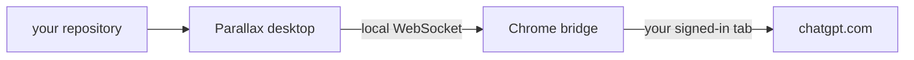

#  parallax

Parallax is a macOS workspace for working through repositories with the ChatGPT
account you are already signed in to. A Chrome extension you load yourself drives
your signed-in tab, so there is no API key to paste and no second account to
create.

<p>
  <a href="https://parallax.akshith.io">Download for macOS</a>
</p>

This repository is a pnpm monorepo with three packages:

- `app` — Electron and Next.js desktop application
- `ext` — Chrome extension that connects ChatGPT to the desktop app
- `web` — download website deployed at `https://parallax.akshith.io`

The first three hops stay on your Mac. Only the last one is a network session,
and it is the ChatGPT tab you already have open. Parallax stores no model
credentials of its own.



## Licence

Parallax is MIT licensed. See [LICENSE](LICENSE).

## Credits

Parallax's desktop app is an adaptation of the [T3 Code](https://github.com/pingdotgg/t3code)
UI layer, which is MIT licensed and copyright T3 Tools Inc. The workspace layout,
message log, composer, and surrounding chrome started there; the agent protocol,
browser bridge, and release pipeline are Parallax's own.

The upstream licence is reproduced in [THIRD-PARTY-NOTICES.md](THIRD-PARTY-NOTICES.md).

## Icons

The app, extension, and site marks are generated from the SVG sources in
`app/build`. After editing one, regenerate every raster:

```bash
pnpm icons
```

That writes the macOS `.icns`, the light and dark dock tiles, and the four
extension PNGs.

## Development

Install every workspace package:

```bash
pnpm install
```

Start the desktop application:

```bash
pnpm dev
```

Start the website:

```bash
pnpm dev:website
```

Run every package's tests and production checks:

```bash
pnpm verify
```

## Releases

Pushing a version tag such as `v0.2.0` runs the release workflow. It verifies the
workspace, builds the signed and notarized universal macOS application, packages
the Chrome extension, and publishes the update metadata and downloads to a GitHub
Release.

The website resolves its download buttons against the newest published GitHub
Release, so releases do not require hardcoded website changes.
